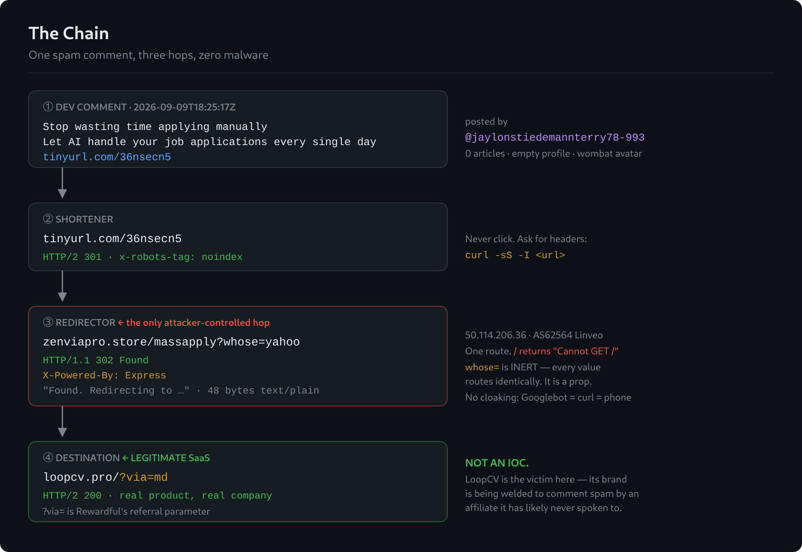
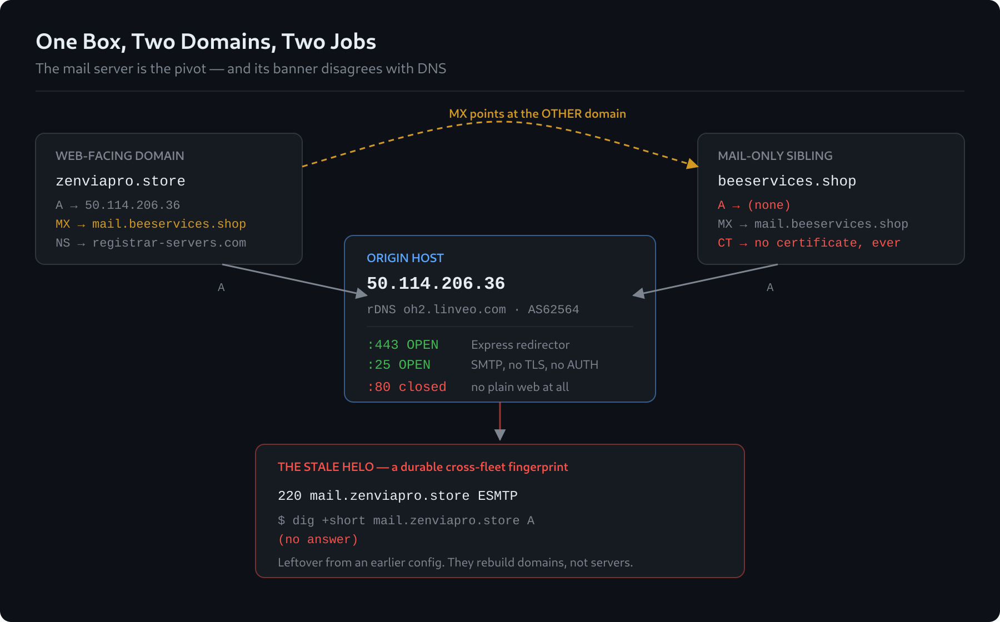
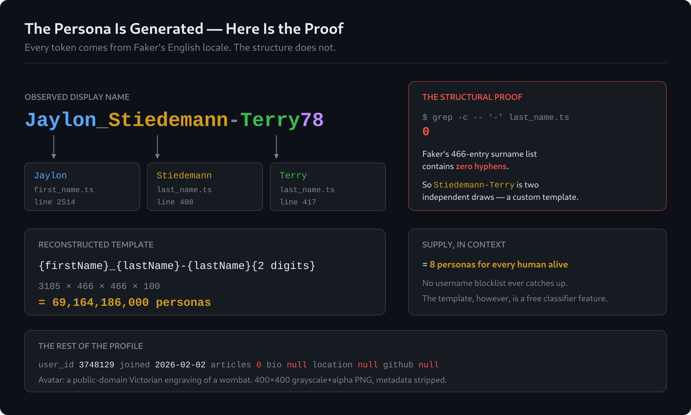
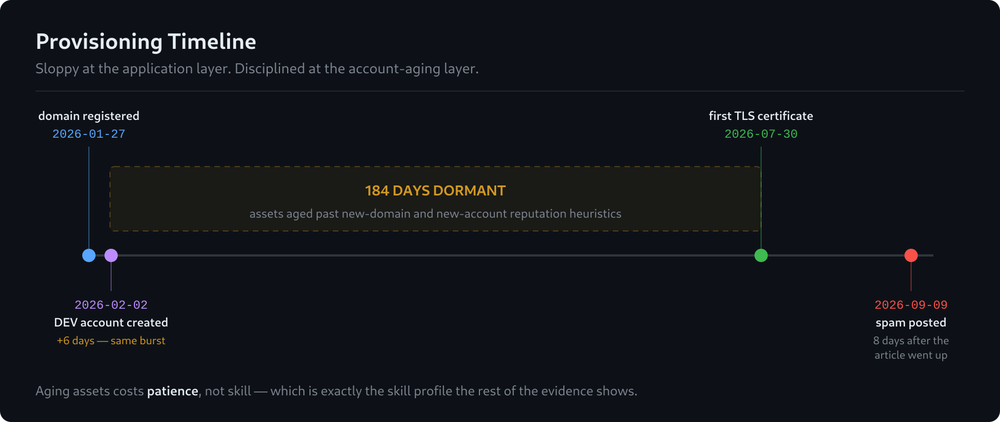
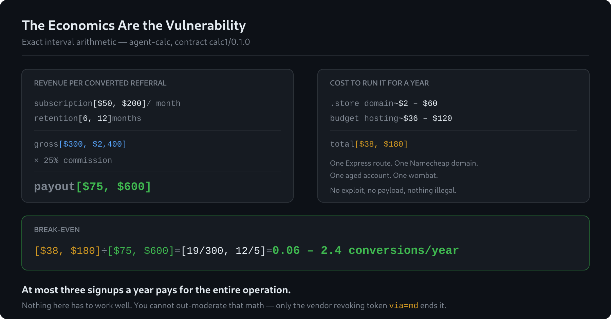
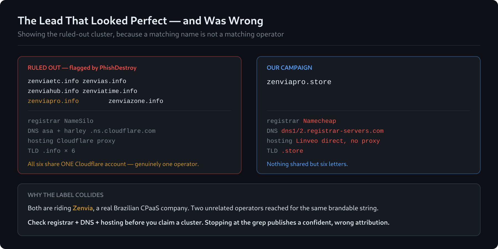

# Anatomy of a DEV Comment-Spam Campaign

[](https://tokentip.to/@copyleftdev)
[](evidence/raw)
[](evidence/iocs.csv)
[](#scope-and-ethics)
[](LICENSE)


<sub>Hero image is an **AI-generated illustration**, not evidence — every prop encodes a finding. Model, prompts and rationale: [`assets/HERO-PROVENANCE.md`](assets/HERO-PROVENANCE.md).</sub>

> A spam comment landed on one of my DEV posts. I followed it all the way down.
> There is no malware at the bottom — there is a legitimate SaaS product with an
> affiliate code on it, a persona generated by `faker.js`, and a 19th-century
> engraving of a wombat.
>
> **The economics are the vulnerability. Three signups a year pays for the whole operation.**

This repository is the evidence file. Every claim below is backed by a raw capture in
[`evidence/raw/`](evidence/raw) and reproducible with [`scripts/reproduce.sh`](scripts/reproduce.sh).
The narrative write-up lives in [`ARTICLE.md`](ARTICLE.md).

---

## The chain



Three hops from a throwaway comment to a real company's checkout page:

```
dev.to comment
  → 301  tinyurl.com/36nsecn5
  → 302  zenviapro.store/massapply?whose=yahoo     ← the only attacker-controlled hop
  → 200  loopcv.pro/?via=md                        ← legitimate SaaS + Rewardful referral token
```

## Verdict

| Question | Answer |
|---|---|
| Is it malware? | **No.** No payload, no exploit, no C2, no credential harvesting. |
| What is it? | Affiliate-referral monetization of unsolicited comment spam. |
| Is the destination malicious? | **No.** LoopCV is a real product being abused by a third-party affiliate. |
| Is there cloaking? | **None.** Googlebot, `curl`, mobile and no-UA all get the same 302. |
| Is it in any threat feed? | **No** — and correctly so. Two independent sources say `NOT_OBSERVED`. |
| Did attribution succeed? | **No.** See [Attribution](#attribution-none-and-that-is-the-finding). |
| Who actually loses? | The vendor whose brand is welded to the spam, and the platform's signal-to-noise. |

---

## The infrastructure



One budget VPS doing two jobs. The web side is a stock Express app that never had
`X-Powered-By` stripped, serving exactly one route — `/` returns Express's default
`Cannot GET /`. The mail side is a minimal cleartext MTA with no `STARTTLS` and no `AUTH`.

Two findings generalize beyond this campaign:

- **`whose=` is inert.** Every value — `yahoo`, `gmail`, `devto`, empty, garbage — routes
  identically ([`04-whose-param-matrix.txt`](evidence/raw/04-whose-param-matrix.txt)).
  The one piece of the URL that looks like operational sophistication is decoration.
- **The SMTP HELO is stale.** The banner announces `mail.zenviapro.store`, which has no
  A record, while the MX points at the sibling domain. Operators rebuild domains, not
  servers — a banner that disagrees with DNS is a durable cross-fleet pivot.

## The persona




The account `jaylonstiedemannterry78-993` has zero articles, an entirely empty profile,
and a display name whose every token appears in [Faker's](https://github.com/faker-js/faker)
English locale — vendored here in [`evidence/vendor/`](evidence/vendor) so you can check it yourself.

The structural proof is the good part. Faker's surname list has **466 entries and zero
hyphens**, so `Stiedemann-Terry` cannot be one surname — it is two independent draws. That
rules out stock `faker.internet.username()` and pins a custom template with a namespace of
**69,164,186,000** personas, roughly eight per living human.

The avatar is a public-domain Victorian engraving of a wombat. There is no real person here
to name; that is the finding, not a redaction.

## The timeline



Domain and account were provisioned six days apart, then sat dormant for 184 days before
activation. That is aged-asset tradecraft, and it sits in genuine tension with the sloppiness
everywhere else: **sloppy at the application layer, disciplined at the account-aging layer.**
Aging assets costs patience, not skill.

## The economics



Computed with exact interval arithmetic ([`15-economics.txt`](evidence/raw/15-economics.txt)),
not floating point:

```
gross per referral   [$50, $200] × [6, 12]      = [$300, $2,400]
commission at 25%    [$300, $2,400] ÷ 4         = [$75, $600]
break-even           [$38, $180] ÷ [$75, $600]  = [19/300, 12/5]  =  0.06 – 2.4 conversions/yr
```

Nothing here has to work *well*. The copy can be terrible, the tracking parameter fake, the
404s leaky, the mascot a wombat. At most three conversions and the year is paid for. You
cannot out-moderate that math — the only lever that moves is the payout.

> **Input caveats, stated plainly:** the 25% / $50–200 / 6–12 month figures are publicly
> reported for LoopCV's affiliate program, not taken from LoopCV's own terms page. The
> $38–180 annual infrastructure cost is an estimate, not an observation.

## Attribution: none, and that is the finding



GitHub code search returns **zero hits** for the TinyURL slug, the origin IP, and both
domains. PhishDestroy's [`destroylist`](https://github.com/phishdestroy/destroylist) —
202,659 curated scam domains — contains none of them either.

A six-domain `zenvia*.info` cluster flagged in
[`phishdestroy/namesilo-evidence`](https://github.com/phishdestroy/namesilo-evidence) looked
like a match and **is not one**: NameSilo/Cloudflare/`.info` against our
Namecheap/`registrar-servers.com`/Linveo/`.store`. Both merely ride the name of Zenvia, a
real Brazilian CPaaS company. It is documented here rather than dropped, because stopping at
the grep would have published a confident, wrong attribution.

What GitHub *did* give up is the affiliate ecosystem. LoopCV referral links appear in public
repos as SEO backlinks, tagged `?via=abdul`, `?via=toolify`, `?via=sang-kwon` — real names
and handles. Ours is `?via=md`. Two characters, nothing to search.

**The only deliberate opsec in this entire campaign is on the string that gets paid.**

---

## Indicators

Full machine-readable set with confidence ratings: [`evidence/iocs.csv`](evidence/iocs.csv).

| Indicator | Type | Notes |
|---|---|---|
| `tinyurl.com/36nsecn5` | URL | Shortener entry point |
| `zenviapro.store` | Domain | Redirector; Namecheap; created 2026-01-27 |
| `https://zenviapro.store/massapply` | URL | The only live route |
| `beeservices.shop` | Domain | Mail-only sibling; no A record, no CT history |
| `mail.beeservices.shop` | Hostname | MX for `zenviapro.store` |
| `50.114.206.36` | IPv4 | Origin; 443 + 25 open, 80 closed |
| `AS62564` / `oh2.linveo.com` | ASN / rDNS | Linveo, Ohio |
| `jaylonstiedemannterry78-993` | DEV account | user_id 3748129; joined 2026-02-02; 0 articles |

Behavioural signatures generalize further than the atoms above:

| Signature | Value |
|---|---|
| Affiliate token | `via=md` (Rewardful format) |
| Inert campaign param | `whose=<anything>` — routing-neutral |
| Server fingerprint | `X-Powered-By: Express` + body `Found. Redirecting to ` |
| SMTP banner | `220 mail.zenviapro.store ESMTP` — does not resolve |
| SMTP capabilities | No `STARTTLS`, no `AUTH` |
| DMARC | Absent on both domains |
| Persona template | `{firstName}_{lastName}-{lastName}{NN}`, all tokens ∈ Faker `en` |
| Provisioning pattern | Domain + account within 7 days, then ~6 months dormant |

> [!WARNING]
> **`loopcv.pro` is not an indicator of compromise.** It is a legitimate destination being
> abused by a third-party affiliate. Do not blocklist it. Blocklisting the victim is how
> threat intel gets a bad name.

## Evidence index

| File | Contains |
|---|---|
| [`01-tinyurl-headers.txt`](evidence/raw/01-tinyurl-headers.txt) | Shortener response headers, redirect refused |
| [`02-redirect-chain.txt`](evidence/raw/02-redirect-chain.txt) | Full three-hop chain |
| [`03-ua-cloaking-matrix.txt`](evidence/raw/03-ua-cloaking-matrix.txt) | Four user agents, identical results |
| [`04-whose-param-matrix.txt`](evidence/raw/04-whose-param-matrix.txt) | Seven parameter values, identical results |
| [`05-endpoint-surface.txt`](evidence/raw/05-endpoint-surface.txt) | One live route, everything else 404 |
| [`06-dns.txt`](evidence/raw/06-dns.txt) | A / MX / TXT / DMARC across both domains |
| [`07-whois.txt`](evidence/raw/07-whois.txt) | Registration dates and registrar |
| [`08-tls-cert.txt`](evidence/raw/08-tls-cert.txt) | Let's Encrypt single-SAN cert, issued 2026-07-30 |
| [`09-host.txt`](evidence/raw/09-host.txt) | Port state, rDNS, ASN |
| [`10-smtp.txt`](evidence/raw/10-smtp.txt) | Banner and EHLO capabilities |
| [`11-comment-thread.json`](evidence/raw/11-comment-thread.json) | The comment thread from DEV's public API |
| [`12-account.json`](evidence/raw/12-account.json) | The spam account's public profile |
| [`13-faker-verification.txt`](evidence/raw/13-faker-verification.txt) | Line numbers, entry counts, hyphen count, collision test |
| [`14-github-hunt.txt`](evidence/raw/14-github-hunt.txt) | Attribution searches and the ruled-out cluster |
| [`15-economics.txt`](evidence/raw/15-economics.txt) | Exact interval arithmetic with input caveats |

Working notes with full command output: [`evidence/EVIDENCE.md`](evidence/EVIDENCE.md).

## Reproduce it

```sh
./scripts/reproduce.sh
```

Requires `curl`, `dig`, `jq`, `openssl`. Everything is read-only.

> [!NOTE]
> Step 8 opens a TCP connection to port 25. The server's `EHLO` reply echoes **your own**
> reverse DNS back at you. Run it from a VPS, not from home — the script redacts that line,
> but the value still crosses your terminal.

## Scope and ethics

Passive reconnaissance only: DNS, WHOIS, Certificate Transparency, HTTP response headers,
one TCP banner grab, and DEV's own public API. No systems were accessed, no credentials
used, no vulnerability exploited, and nothing was written to any third-party service.

Every host examined was published by its operator for public consumption. The DEV account
named here is a provably synthetic persona with no real identity attached.

## Responsible disclosure

Attribution stops at the edge of what is externally observable. Two parties hold the
remaining links, and neither is discoverable from outside:

- **LoopCV / Rewardful** know who owns affiliate token `md`. Revoking one token ends this
  campaign permanently — a one-line fix available to exactly one party.
- **DEV / Forem** know the signup and posting IPs behind user 3748129.

If you run an affiliate program: require affiliates to declare traffic sources, ban
unsolicited comment and forum posting in the terms, flag tokens whose traffic arrives
overwhelmingly via shorteners with no referrer, and revoke on report without requiring a
lawyer.

## License

Report, evidence and diagrams: **CC BY 4.0**. Scripts: **MIT**. See [LICENSE](LICENSE).
Vendored Faker locale data remains under Faker's own MIT license.
